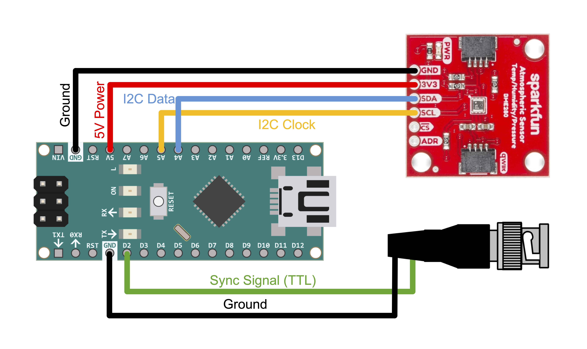

## Weather Sensor GUI

This repository provides the necessary instructions for implementing a weather (i.e., temperature, humidity, pressure) reader using an Arduino. 
These data streams are also synchronized with external devices by sending an outgoing TTL pulse upon every read. This repository contains:
- Instructions for hardware and software in this README
- The code file to be loaded on the Arduino (`weather.ino`)
- The python file that defines the GUI and the interfaces with the Arduino (`weather.py`)
- The python file to be called to boot up and GUI and start/stop recordings (`record_weather.py`)

## *_Hardware and Software Requirements_*

### *_Hardware_*
- Arduino Nano
- Arduino Nano Screw Terminal Adapter (for easier wiring assembly)
- Long Mini-USB cable (I'm using 10ft to feed through a wall)
- SparkFun BME280 sensor
- 4 jumper wires to connect sensor to Arduino (consider [4-wire twisted cable](https://www.mouser.com/ProductDetail/Alpha-Wire/1102-MC005/?qs=wyMAH8%252byTS0W2TOBGluCtOxZjpk%2F6EY8pAttAFp3gGo%3D))
- BNC cable to connect Arduino to I/O box for synchronization

### *_Software_*
- Arduino code to make measurements at some frequency (1Hz by default) and send a TTL pulse on every read
- Python code to read measurements from the Arduino
- Python code to display a GUI with the current readings, toggle recordings on and off, and save data

### *_Hardware Setup_*
- Set up the Arduino Nano with the SparkFun BME280 and the BNC sync cable using the following diagram:

- The SparkFun BME280 can be hung by the big holes in the corners using a zip-tie somewhere inside the chamber. Make sure it’s not in a corner where air might not flow evenly. Choose a central location in the chamber. Alternatively, you can use nylon standoffs.

## Instructions
1. Install the Arduino IDE on your computer.
2. Install the Adafruit BME280 library from the Arduino Library Manager.
    - In the IDE, Sketch -> Include Library -> Manage Libraries -> search Adafruit BME280
    - If prompted, also install the Adafruit Unified Sensor.
3. Load the `weather.ino` file in this directory to your Arduino.
4. Make a conda env to run the python code:
    - Open a terminal window and `cd` into this directory.
    - Run `conda env create -n weather -f environment.yaml` to create an env.
5. Run `conda activate weather` to activate the env
6. In `record_weather.py`, fill out the `recording_path` where you want your data to be saved.
    - Update any other inputs into the GUI.
    - For example, make sure that your `serial_port` matches the one your Arduino is set to, and that your `baud_rate` matches the one written in `weather.ino`.
7. Run `python record_weather.py` to boot up the GUI.
8. Click "Record" when ready to start recording.

## Notes
- Do not read from the BME280 sensor too frequently (>1Hz).
    - This can cause the sensor to heat up which can change the readings and make them unreliable.
- Make sure to position the sensor somewhere where the air flows freely so that the readings reliably reflect the ambient air.